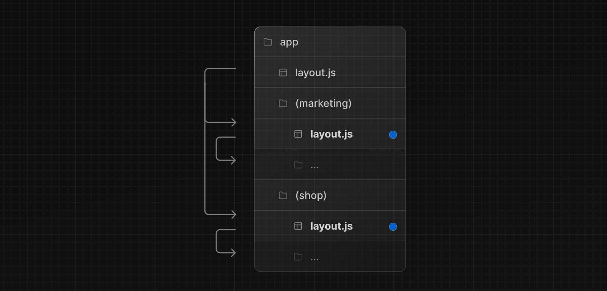

`app`ディレクトリでは、ネストされたフォルダは通常 URL パスにマップされます。しかし、フォルダーを **ルートグループ** としてマークすることで、そのフォルダーがルートの URL パスに含まれないようにできます。

これにより、URL パス構造に影響を与えることなく、ルート Segment とプロジェクトファイルを論理的なグループに整理できます。

ルートグループは次のような場合に便利です：

- [ルートをグループに整理する](#url-パスに影響を与えずにルートを整理する)例えば、サイトセクション、インテント、チームごとなどです。
- 同じルート Segment レベルで[入れ子になったレイアウト](/docs/app-router/building-your-application/routing/pages-and-layouts)を有効にする：
  - 複数のルートレイアウトを含め、[同じセグメントで複数のネストされたレイアウトを作成する](#複数のルートレイアウトを作成する)
  - [共通セグメント内のルートのサブセットにレイアウトを追加する](#特定の-segment-をレイアウトに組み込む)

## 規約

ルートグループはフォルダの名前を括弧で囲むことで作成できます： `(folderName)`

## 例

### URL パスに影響を与えずにルートを整理する

URL に影響を与えずにルートを整理するには、関連するルートをまとめるグループを作ります。括弧内のフォルダは URL から省略されます（例：`(marketing)`や`(shop)`）。

`(marketing)` と `(shop)` 内のルートは同じ URL 階層を共有していますが、それぞれのフォルダ内に `layout.js` ファイルを追加することで、グループごとに異なるレイアウトを作成できます。

### 特定の Segment をレイアウトに組み込む

特定のルートをレイアウトに組み込むには、新しいルートグループ (例 `(shop)`) を作成し、同じレイアウトを共有するルート (例 `account` と `cart`) をグループに移動します。グループ外のルートはレイアウトを共有しません（例 `checkout`）。

### 複数のルートレイアウトを作成する

複数の[ルートレイアウト](/docs/app-router/building-your-application/routing/pages-and-layouts#ルートレイアウト-必須)を作成するには、トップレベルの`layout.js`ファイルを削除し、各ルートグループの中に`layout.js`ファイルを追加します。これは、アプリケーションを全く異なる UI やエクスペリエンスを持つセクションに分割するのに便利です。各ルートレイアウトには `<html>` タグと `<body>` タグを追加する必要がある。

上の例では、`(marketing)`と`(shop)`の両方がルートレイアウトを持っています。

> **Good to know:**
>
> - ルートグループの名前は、整理すること以外に特別な意味はありません。それらは URL パスには影響しません。
> - ルートグループを含むルートは、他のルートと同じ URL パスに解決されるべきではありません。例えば、ルートグループは URL 構造に影響を与えないので、 `(marketing)/about/page.js` と `(shop)/about/page.js` はどちらも `/about` に解決され、エラーを引き起こします。
> - トップレベルの `layout.js` ファイルなしで複数のルートレイアウトを使用している場合、ホームの `page.js` ファイルはルートグループの 1 つで定義する必要があります。
>   例えば、`app/(marketing)/page.js`です。
> - **複数のルートレイアウト**にまたがってナビゲートすると、**フルページロード**が発生します。例えば、`app/(shop)/layout.js` を使用している `/cart` から `app/(marketing)/layout.js` を使用している `/blog` に移動すると、フルページロードが発生します。これは複数のルートレイアウトに適用されます。
