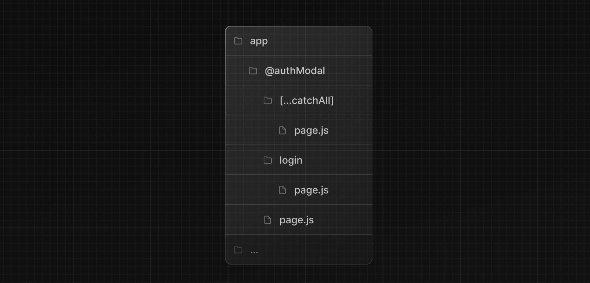

Parallel Routes を使用すると、1 つまたは複数のページを同じレイアウトで同時に、または条件付きでレンダリングできます。ダッシュボードやソーシャルサイトのフィードなど、アプリの非常に動的なセクションの場合、パラレルルーティングを使用して複雑なルーティングパターンを実装できます。

例えば、チームページと分析ページを同時にレンダリングできます。


パラレル・ルーティングでは、各ルートに独立したエラーとロードの状態を定義できます。


並列ルーティングでは、認証状態などの特定の条件に基づいてスロットを条件付きでレンダリングすることもできます。これにより、同じ URL 上で完全に分離されたコードが可能になります。


## 規約

並列ルートは名前付き**スロット**を使って作成されます。スロットは `@folder` の規約で定義され、同じレベルのレイアウトに小道具として渡されます。

> スロットはルートセグメントではなく、URL 構造には影響しません。ファイルパス `/@team/members` は `/members` からアクセスできます。

例えば、`@analytics` と `@team` ファイル構造は 2 つの明示的なスロットを定義しています。


上記のフォルダ構造は、`app/layout.js`のコンポーネントが`@analytics`と`@team`スロットのプロップを受け入れ、`children`プロップと並行してレンダリングできることを意味します。

```tsx title="app/layout.tsx" switcher
export default function Layout(props: {
  children: React.ReactNode
  analytics: React.ReactNode
  team: React.ReactNode
}) {
  return (
    <>
      {props.children}
      {props.team}
      {props.analytics}
    </>
  )
}
```

> **Good to know:** `children`は暗黙のスロットで、フォルダにマッピングする必要はありません。つまり、`app/page.js`は`app/@children/page.js`と等価です。

## マッチしないルート

デフォルトでは、スロット内でレンダリングされるコンテンツは現在の URL と一致します。

マッチしないスロットの場合、Next.js がレンダリングするコンテンツは、ルーティング手法とフォルダ構造に基づいて異なります。

### `default.js`

Next.js が現在の URL からスロットのアクティブ状態を回復できない場合に、フォールバックとしてレンダリングする `default.js` ファイルを定義できます。

次のようなフォルダ構造を考えてみましょう。`team`スロットには`settings`ディレクトリがありますが、`@analytics`スロットにはありません。


#### ナビゲーション

ナビゲーションの際、Next.js はスロットの以前のアクティブな状態を、たとえそれが現在の URL と一致しなくてもレンダリングします。

#### リロード

リロードすると、Next.js はまず、一致しないスロットの `default.js` ファイルのレンダリングを試みます。それが利用できない場合は、404 がレンダリングされます。

> マッチしないルートに対する 404 は、並列レンダリングすべきでないルートを誤ってレンダリングしないようにするのに役立ちます。

## `useSelectedLayoutSegment(s)`

[`useSelectedLayoutSegment`](/docs/app-router/api-reference/functions/use-selected-layout-segment)と[`useSelectedLayoutSegments`](/docs/app-router/api-reference/functions/use-selected-layout-segments)はどちらも `parallelRoutesKey` を受け取り、そのスロット内でアクティブなルート Segment を読み込むことができます。

```tsx title="app/layout.tsx" switcher
'use client'
import { useSelectedLayoutSegment } from 'next/navigation'

export default async function Layout(props: {
  //...
  authModal: React.ReactNode
}) {
  const loginSegments = useSelectedLayoutSegment('authModal')
  // ...
}
```

<!-- textlint-disable -->

ユーザーが`@authModal/login`、または URL バーの`/login`に移動すると、`loginSegments`は文字列`"login"`と等しくなります。

<!-- textlint-enable -->

## Examples

### モーダル

パラレルルーティングはモーダルのレンダリングに使用できます。


`@authModal`スロットは`<Modal>`コンポーネントをレンダリングします。

```tsx title="app/layout.tsx" switcher
export default async function Layout(props: {
  // ...
  auth: React.ReactNode
}) {
  return (
    <>
      {/* ... */}
      {props.auth}
    </>
  )
}
```

```tsx title="app/@auth/login/page.tsx" switcher
import { Modal } from 'components/modal'

export default function Login() {
  return (
    <Modal>
      <h1>Login</h1>
      {/* ... */}
    </Modal>
  )
}
```

アクティブでないときにモーダルのコンテンツがレンダリングされないようにするには、`null` を返す `default.js` ファイルを作成します。

```tsx title="app/@auth/login/default.tsx" switcher
export default function Default() {
  return null
}
```

#### モーダルの解除

モーダルがクライアントのナビゲーションによって開始された場合、例えば `<Link href="/login">` を使用した場合、`router.back()` を呼び出すか、`Link` コンポーネントを使用することでモーダルを解除できます。

```tsx title="app/@auth/login/page.tsx" highlight="5" switcher
'use client'
import { useRouter } from 'next/navigation'
import { Modal } from 'components/modal'

export default async function Login() {
  const router = useRouter()
  return (
    <Modal>
      <span onClick={() => router.back()}>Close modal</span>
      <h1>Login</h1>
      ...
    </Modal>
  )
}
```

> モーダルに関するより詳しい情報は、[Intercepting Routes](/docs/app-router/building-your-application/routing/intercepting-routes) セクションにあります。

他の場所に移動してモーダルを解除したい場合は、キャッチオールルートを使用することもできます。



```tsx title="app/@auth/[...catchAll]/page.js"
export default function CatchAll() {
  return null
}
```

> キャッチオールルートは `default.js` より優先されます。

### 条件付きルーティング

並列ルーティングは条件付きルーティングを実装するために使用できます。例えば、認証状態に応じて `@dashboard` または `@login` ルートをレンダリングできます。

```tsx title="app/layout.tsx" switcher
import { getUser } from '@/lib/auth'

export default function Layout({
  dashboard,
  login,
}: {
  dashboard: React.ReactNode
  login: React.ReactNode
}) {
  const isLoggedIn = getUser()
  return isLoggedIn ? dashboard : login
}
```


